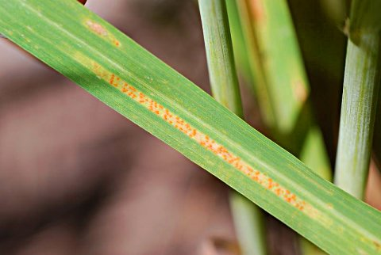

```{r echo = FALSE, message = FALSE}
library(knitr)
opts_chunk$set(echo = FALSE, message = FALSE, fig.width = 9)
```


## Background

Stripe rust of wheat is caused by a basidiomycete pathogen called *Puccinia triticina*.
Parallel lines of pustules form on the leaves of wheat plants, releasing enormous numbers of spores, especially when it is cool and humid.
Spores are dispersed by wind, sometimes very far, and infect more wheat or other grass hosts.
It can cause up to 50% loss of crop yields and seems to be adapting to warmer temperatures and resistant varieties of wheat.
This disease is typically controlled using resistance, but fungicides also work. 

I will be using data found on [this tutorial](http://www.apsnet.org/edcenter/advanced/topics/EcologyAndEpidemiologyInR/DiseaseProgress/Pages/StripeRust.aspx) to explore the effects of wheat cultivar and fungicide treatment on the incidence of disease caused by *Puccinia triticina*.
 I will do this by comparing the **AUDPC** (area under disease progress curve) for the three cultivars and two fungicide treatments.




## Methods

I will use the R script called `original_audpc_code.R` to do the following:

1. Parse the file using `read.csv`
1. Tidy up the data using `reshape2` and `dplyr` functions
1. Graph the disease progress curves using `ggplot2`
1. Calculate AUDPC for each treatment
1. Graph AUDPC results


## Results

#### Disease progress curve

The disease was first detected in all treatments on Julian day 140 (May 19) and continued to rise until the end of the study in all treatments.

```{r}
library('dplyr')
library('tidyr')
library('agricolae')
library('knitr')
library('ggplot2')
library('magrittr')

data <- read.csv("fungicide_data.csv")

long_data <- data %>% 
  gather(cultivar, disease, -Julian.Date) %>% # gather by cultivar, call the new variable disease, and keep the Julian.Date column
  mutate(fungicide = grepl(pattern = "\\.trt$", cultivar, ignore.case = TRUE)) %>% # add fungicide column
  transform(fungicide = ifelse(fungicide, "treated", "untreated")) %>% # make it sensible
  transform(cultivar = gsub("\\.trt$", "", cultivar, ignore.case = TRUE)) # clean up the variable

# Creating a line graph of disease progress
g <- ggplot(long_data)
g <- g + geom_line(aes(x = Julian.Date, y = disease, linetype = cultivar))
g <- g + facet_wrap(~fungicide)
g <- g + theme_bw()
g <- g + labs(x = "Julian Day", y = "Percent Disease", title = "Disease Progress Curve")
g
```


#### AUDPC

In general, Jagger is the most susceptible and Cutter is the least.
The incidence of disease for all cultivars was less when treated with fungicides.

```{r}
audpc_data <- long_data %>% 
  group_by(cultivar, fungicide) %>% 
  summarize(AUDPC = audpc(disease, Julian.Date)) 

# Creating a barplot for the AUDPC results
audpc_plot <- ggplot(audpc_data, aes(x = fungicide, y = AUDPC, fill = cultivar))
audpc_plot <- audpc_plot + geom_bar(stat = "identity", position = "dodge")
audpc_plot <- audpc_plot + theme_bw()
audpc_plot <- audpc_plot + labs(title = "AUDPC results")
# for color, uncomment the line below
# audpc_plot <- audpc_plot + scale_fill_brewer(type = "qual", palette = "Set1")
audpc_plot <- audpc_plot + scale_fill_grey()
audpc_plot
```


## Questions

The following questions were posed in the [exercise on the APS website](http://www.apsnet.org/edcenter/advanced/topics/EcologyAndEpidemiologyInR/DiseaseProgress/Pages/StripeRust.aspx):

> How does the size of the fungicide effect compare to the effect of resistance? 

Examining the second figure, it appears that the application of fungicide reduces disease severity by about 40% on average. The effect size of resistance is similar. 

> Would it be the same as resistance?

While the average percent reduction of disease severity from fungicide and resistance are similar, whether fungicide applied to a susceptible variety (Jagger) would be equivalent to fungicide not applied to a resistant variety depends on the resistant variety used; untreated, Cutter (resistant) shows less disease severity than treated Jagger (susceptible), but untreated 2137 (resistant) has higher disease severity than treated Jagger.  

> Since the fungicide typically is only active for two weeks after application, after looking at your graph, when do you think the fungicide was applied?

The disease progress curves on the first graph show a stall in the increase of disease incidence after day 140 that is not present in the curves for untreated wheat. This suggest that fungicide was applied around day 140, although the exact day is hard to tell since disease incidence was recorded weekly.  

## Conclusions

In general, the AUDPC only changes between the fungicide treatments during the last 20 days of the experiment. 
The Cutter seemed to be more resistant than 2137 and Jagger was susceptible, as expected. 
The results suggest that using Cutter wheat without fungicide is equivalent to using Jagger with fungicide, but the best yields will be obtained when Cutter wheat treated with fungicide is used.
